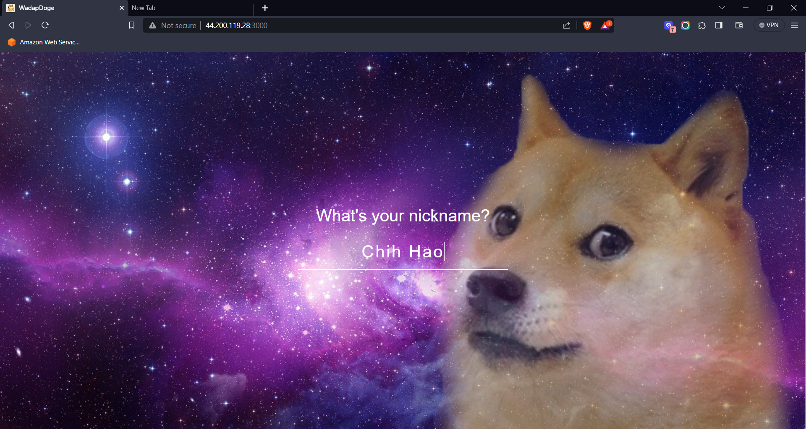
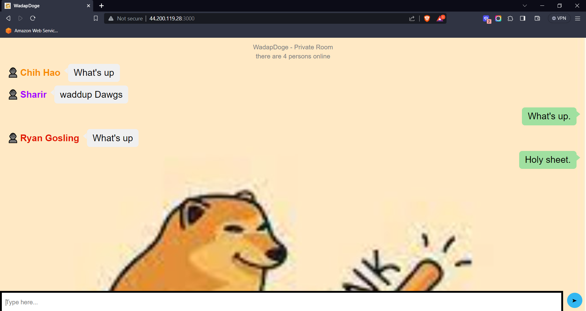
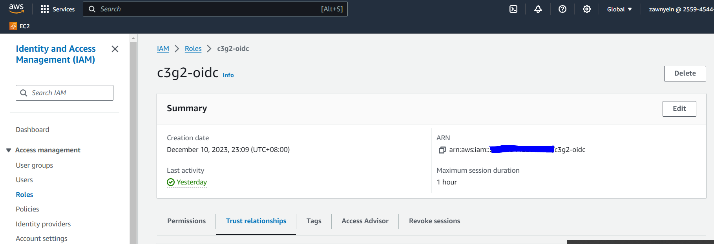
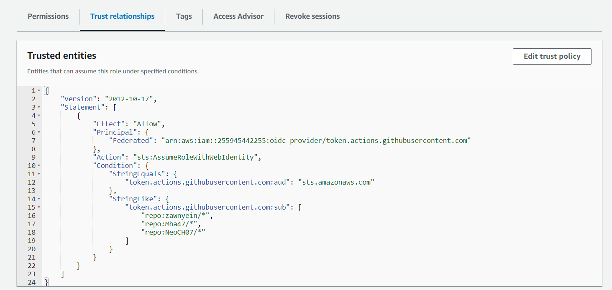

# Output

Wadapdoge is a simple chat server application that uses Express and Socket.io. 




## Package and Dependencies
Necessary dependencies are found in package.json. 

These scripts will be executed when you run npm install command is triggered in Dockerfile.

The main dependencies for this app are:
- express: Web application framework for Node.js.
- socket.io: Real-time bidirectional event-based communication library for Node.js.

```bash
 {
  "name": "c3g2-capstone-rev1",
  "version": "1.0.0",
  "description": "Wadap Doge",
  "main": "index.js",
  "scripts": {
    "start": "node index.js",
    "test": "jest"
  },
  "repository": {
    "type": "git",
    "url": "git+https://github.com/Mha47/c3g2-capstone-rev1.git"
  },
  "author": "C3G2",
  "license": "ISC",
  "bugs": {
    "url": "https://github.com/Mha47/c3g2-capstone-rev1/issues"
  },
  "homepage": "https://github.com/Mha47/c3g2-capstone-rev1#readme",
  "dependencies": {
    "express": "^4.18.2",
    "socket.io": "^4.7.2"
  },
  "devDependencies": {
    "jest": "^29.7.0",
    "socket.io-client": "^4.7.2"
  }
}
```

## Unit Testing

This step executes unit tests using the "npm test" command based on the test script configured in package.json. In this case, the test will be running jest version 29.7.0.This workflow is designed to execute unit tests for a Node.js application. It is triggered after the successful completion of the "pre-deploy" job.

```bash
unit-testing:
    runs-on: ubuntu-latest
    needs: pre-deploy
    name: Unit Testing
    steps:
       # Checkout the latest code from the repository.
      - name: Checkout repo code
        uses: actions/checkout@v3
       # Install the required npm dependencies for the application
      - name: Install dependencies
        run: npm install
      # Execute unit tests using npm test
      - name: Run unit tests
        run: npm test
```

## Containerization 

This Node.js application using the latest version of Node.js is containerized using and Dockerfile sets up as below- a working directory, installs the application dependencies, copies the application code, exposes port 3000, and starts the application.

```docker
#use nodejs with latest version
FROM node:latest

#set working directory
WORKDIR /app

#install the app dependencies
#use wildcard to copy both package.json and package-lock.json
COPY package*.json ./
RUN npm install

#bundle app source
COPY . .

#expose port
EXPOSE 3000

#start the app
CMD ["npm", "start"]

```
## Secrets & Credential Management

Before starting, set up AWS credentials by using OpenID Connect (OIDC) authentication which are stored in the Github Actions Secrets. 

Go to ROLE under IAM in AWS console and create a role. Save the ARN in github repository secret. 


Under the Trust Relationships tab, Add team members/collaborator's github account. Make sure to use wildcard /* behind repo's address.


The AWS credential code in workflow is as below,

```bash
- name: Configure AWS credentials
        uses: aws-actions/configure-aws-credentials@v2
        with:
          role-to-assume: ${{ secrets.IAM_ROLE}}
          aws-region: us-east-1
```

## Create AWS Resources using Terraform

Refer to below link for Terraform files for different environments.

https://github.com/Mha47/c3g2-capstone-rev1/tree/dev/environments

